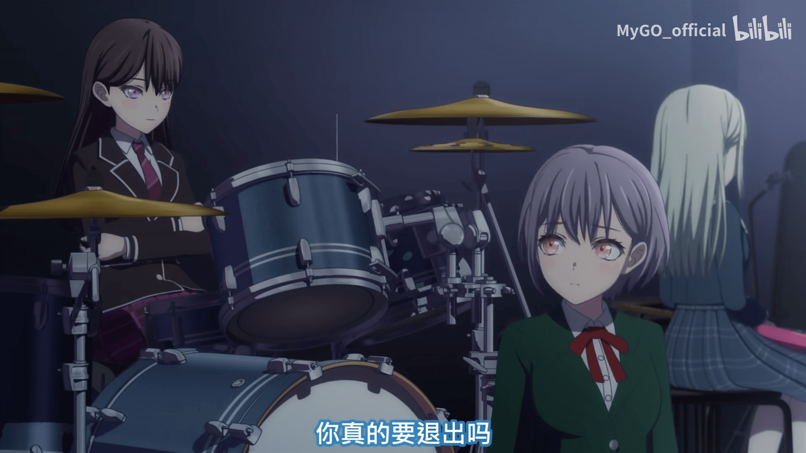
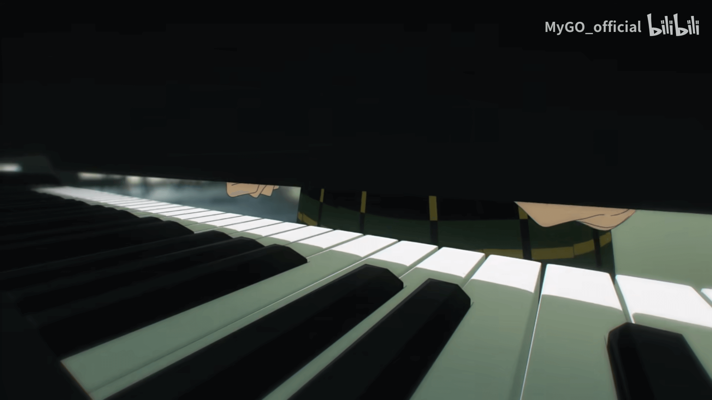
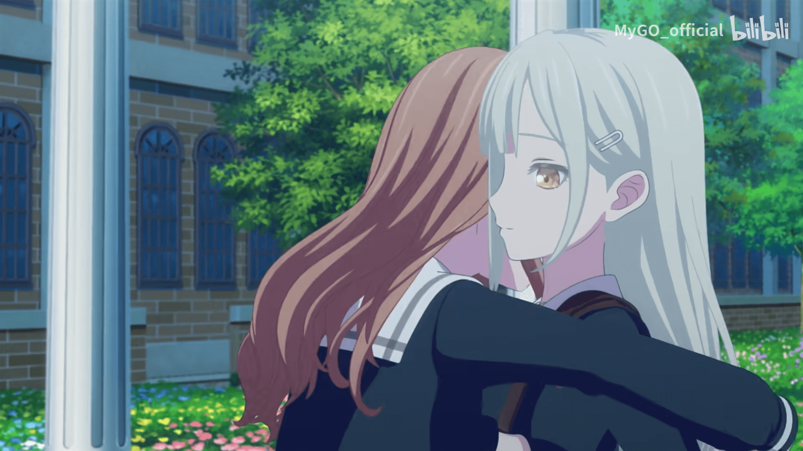

## 前言

施工中

## 第一话

以阴雨天气开局，烘托出压抑的气氛。在这样的雨幕中，人们都举着伞。而在这样的人群中，一个灰蓝色的脑袋直面雨幕就显得更加引人注目。背景的钢琴声略显柔和，一是因为祥子本身演奏的乐器即为钢琴/键盘，二是衬托出暴风雨前的宁静。

压抑的室内无人说话，而上半身湿透的祥子进来之后，拒绝了 soyo 的好意，紧接着语出惊人。我平时不怎么看乐队番，但我知道 Bang Dream! 是组建乐队题材的系列。我相信在所有以组建乐队为题材的动画中，开局宣布乐队的分崩离析也并不多见。

第一次看时，看到这里感觉祥子是一个很不讲理，很任性的人。完全不顾乐队其他人的想法，自己组建乐团又擅自退出，而且完全不说清楚原因。在已经知道祥子的家庭出现重大变故，家道中落的情况下，这里对祥子的不满就完全转化为了心疼，以及对她的坚强的感叹。换做心灵脆弱的人来，现在不会摆出这幅表情，而会哭出声，并向其他成员寻求帮助。但祥子的自尊心极强，这在后面也有体现。凭着这份自尊心，她没有开口求助，并把自己打造成了直接导致乐团分崩离析的恶人，让其他人不会因此而产生隔阂。作为人类而言，不可谓不强大。

第一个回旋镖，回收于第三话。祥子确实说过想快点再办下一次。但在这里矢口否认，也是为了更坚定自己恶人的心态。

rikki 看祥子和灯的表情有很大不同，看灯的表情明显更柔和。rikki 的吊梢眼本身就容易显得凶狠。看灯时却能柔和起来，并且紧接着帮灯质问祥子，可以见得对灯的特殊感情。当然，以后会有无数次的类似场景乃至直球让你感觉到这份感情的。

rikki，平等地赋予所有人压力。

但是非常对我胃口，尤其是这颗美人痣，借别人的话说就是长在我心上了。

在不清楚祥子具体经历了什么样的变故的情况下，这里的镜头显得耐人寻味。祥子一下握紧手臂，有可能只是单纯地想起 crythic 的美好，现在感觉不舍，也有可能是对不在这里的造成这一变故的元凶怒吼着愤怒。

在这时，背景的钢琴也逐渐变得激烈。

soyo 虽然一直想解决问题，但随着一直不开口的睦的一锤定音，气氛直接凝固。睦每次说话基本都会有人伤心呢。

~~剪切线~~展现了黑暗中隐藏的一些破败，以及与光明的从此隔绝，展示了祥子此时的状态。

anon 出场，从伦敦落荒而逃~~神乐光~~面试时提到 anon 当过学生会长，学习也很好，几句话就奠定了一个带着秘密的阳角的形象基础。

anon 午休时找团体的小心机也非常深刻地刻画了人物形象。

然后是对邦邦前作的致敬，我不是邦邦人所以不清楚其他人的感受，不赘述。

接着是 anon 的形象塑造：心机，喜欢出风头的位置，伦敦的闪回暗示了不快的遭遇，吉他落灰以及之后的呕哑嘲哳体现了吉他技术的低劣，完全不适合自己说的吉他&主唱的位置。

因为想站 C 位，所以只能自己找成员。在查看社团和乐队布告时，听到了流淌的钢琴声~~白色相簿~~。循声找到祥子，并提出组乐队的邀请。现在来看，完全是初心者要求大魔王归入自己麾下，初生牛犊不怕虎。

祥子看见 anon，第一反应是问：“你是吹奏部员吗？”暗示了祥子并非是正规途径获取的钢琴使用权。

在 anon 提到乐队后，祥子关闭琴盖的手停住了，这里可以看出祥子对于 crythic 的感情绝非寡淡。

意义不明的对话后，祥子以非常大小姐的口吻拒绝并离开了~~客服小祥到点上班咯~~，营造出高贵的大小姐形象。

抱着死马当活马医的心态，anon 想找灯加入乐队。

迫真摔倒后，迎来第二个回旋镖。回收于第三话。历史总是惊人的相似。同样的膝盖受伤，同样的对笔记本感到怀念，同样地打开笔记本发现歌词，以及，同样的，以光明正大的姿态走近你的心。

但 anon 还顺手帮灯丢了垃圾，伟大的性格。在灯感到沮丧时果断收下创可贴让灯恢复，伟大的性格 x2。也能看出学生会长不是白当的，阳角特有的敏锐。

乐谱左边写了每个人的昵称。

然后是邦邦彩蛋。

依然是初心者打算把大魔王招入麾下。而在第三话听过灯的演唱后，anon 就再也没提出过想要当主唱了。

将灯的重力发言四两拨千斤卸开并顺理成章地把灯拐去卡拉 OK 约会~~其他人做得到吗~~。

即使已不在身边，祥子也依然关注着守护着灯，live 时更是如此。看到这一幕的祥子此时内心是什么滋味呢？

镜头来到大小姐学校月之森。soyo 三句话里四个祥子，看得出对祥子的执念深重，这也是当然的，crythic 中受祥子影响最大的就是灯和 soyo，可以说都是变成人类等级的影响。而睦在被 soyo 抱过之后嘴角微微上翘，结合之后的蛛丝马迹，睦对 soyo 的感情埋得很深，但还是能看得出来。soyo 表达了重组乐团的想法，但睦的表现却很冷淡。因为睦只对 soyo 感兴趣，并且更喜欢重金属，和 crythic 的曲风不合适。

接着是对 rikki 的冷美人形象的塑造。以及邦邦彩蛋。

切到卡拉 OK 约会这边，魅魔初华首次登场（初华是真好看）。

细节倒转机子再递过去。伟大的性格 x3。

第三个回旋镖，沙锤，依然是回收于第三集。灯第一次和 crythic 来卡拉 OK 也是拿沙锤，并且祥子也拿了。这一段也是第二个回旋镖的延续，历史重演。

同样的场景，人面不知何处去，桃花依旧笑春风。于是，循着气氛提出组**一生**乐队，也是很正常的事情吧。

anon 打哈哈，想继续四两拨千斤，但这里失效了。灯感到羞耻，跑路。

真的很敏锐，第一件事就是对打哈哈道歉。明白轻率对待别人心意的不对，即使灯在道歉后摇了摇头示意不必介意，这件事也一定是一根积压在心底的刺。而马上发现并将刺拔出，是阳角特有的敏锐。伟大的性格 x4。

rikki 听到关键词"tomori"立刻回头，并冲过来保护 tomori。

鲜明对比，配合上面塑造的冷美人形象，更体现灯对 rikki 的特殊~~但以后会狠狠爱堕~~。灯继续逃跑，rikki 想追但被 anon 拉住。

🥰表情超棒的。

拆投！铺垫两人的隔阂，但现在冤家有多厉害，以后糖就有多好嗑🥰。

中门对"哈？"（anon 唯一一次哈）

自此第一集结束，太多铺垫和伏笔，第一次看肯定看不出来。而第一次看时也容易感觉慢热，要记的人和事太多，这里的矛盾收尾算是给观众一个悬念，有一个接着看下去的短期动力。

顺便 ed 超好听的，和 op 一样每一集听都是不一样的感受。以各种载体承载的故事效果都不一样，这就是故事的魅力吧。

------
本文持续施工中。