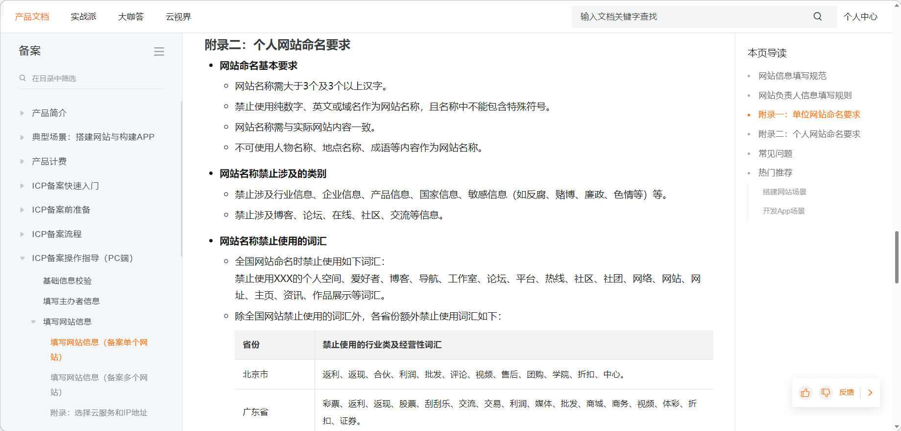
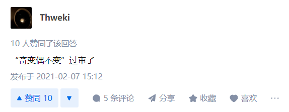
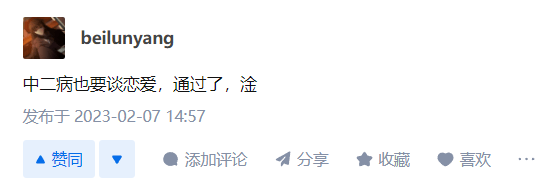

## 前言

建立本站的起因请看关于界面。再次感谢 [naine][naine] 的鼓励和帮助。在建立本站过程中遇到了许多问题，也学到了许多知识。这是本站第一篇正式的文章，用来记录一下建站过程中遇到的问题，踩到的坑，学习到的东西。

想直接看结论和建议请直接拉到该小节最后。

## 服务器和域名

想要建站，最先需要解决的问题就是服务器和域名。如果不介意 IP 裸奔的话，域名可以缓缓。如果想搭在本地并且使用内网穿透的话，服务器也可以缓缓。但为了舒适的体验和方便的管理，个人还是建议在这方面下点成本。实际上这也是搭建博客唯一一个需要**花钱**的地方。搭建其他网站的话我没有接触过，不敢妄加评论，建议各位自行了解查询。

回到正题，在服务器方面，一开始是 naine 发送了一个阿里云的 VPS 的白嫖链接，通过认证之后可以白嫖 7 个月。2 核 2 g，40 g 硬盘，相当不错，这也是我最初接触 VPS，是最初的起点（其实也就三个星期左右前）。在部署了两个小项目之后，在某个原因的推动下我决定建立自己的博客。自此开始正式搭建本站。

首先当然是用白嫖的这个阿里云 VPS 搭建，不用白不用。使用阿里云的 Centos 镜像，换源之后使用还算顺畅。但很快问题来了，在我最开始看的教程中，可以把博客部署在 github 的仓库上，这样可以使用仓库的域名访问，不用 IP 裸奔，但国内的 VPS 不科学上网的情况下连接 github 实在是比较玄学，相信大家都明白的。而且使用 github 的仓库当域名有点挫，长度也稍显拖泥带水，也不利于记忆。于是我作为学生党，最先考虑去白嫖域名。也是 naine 发给我的 Porkbun 白嫖域名，让我成功白嫖到一个还不错的域名。在查找教程和 naine 的指点下，用 Cloudflare (下文简称 cf)将域名解析到 IP 之后，顺便装了 Nginx，配置了一下 cf 的 SSL 证书。就在此时出问题了，访问域名显示 error 521。按照很多网友的说法，这是 SSL 证书的问题，这让我们在 SSL 证书上耗费了许多时间（全部木大），但在谷歌了各种办法和 naine 的排查后，终于确定了就是单纯的用阿里云 VPS 没有在国内备案。。。可以直接用 IP 访问，但不可以用域名访问。若是大陆外的服务器则不需要备案，大陆内的所有服务器都需要备案。至此开始思考下一步解决方案。

### 备案？很蓝的啦

鉴于这个问题只需要备案即可解决，我估摸着我做博客也不违法，备案也没什么问题，所以我就去了解备案流程，准备备案。但发现国内 VPS 必须要国内域名才能备案。而现在的域名是国外域名商的，不可以备案，于是我先尝试能不能把这个域名转入阿里云，阿里云竟然提示新域名注册需要满 60 天后才能转入。我觉得太久了，直接放弃，遂直接在阿里云买了个新域名，也就是现在本站的域名。然后开始备案，在备案过程中了解到现在天朝对个人运营网站的备案态度比较严格（并且越来越严格），具体表现在备案时的网站名称（与实际显示的网页的名称和内容无关）和网站类型不知如何填写，缺乏指引。如果填写内容不合规定，备案不通过还会退回，中途非常浪费时间。尤其是网站名称，限制非常非常多。

还有一些很乐的回答。


本身备案时间就久，如果申请不合格，打回重来更久。并且不仅需要 ICP 备案，还需要公安备案，并且要在网页中摆放备案信息，否则可能有高额罚款。我感觉不仅麻烦而且有种寄人篱下的卑微，有点难以接受。并且根据现在的严格程度，估计备案也得 60 天左右，还是太久。遂放弃，由于只有大陆的服务器需要备案，因此转而寻找大陆外的 VPS。

### 对于几家服务商的体验和看法

仅供参考

|服务商|体验|看法|
|:--:|:--:|:--:|
|阿里云|使用最久，体验最多，控制台较为“简洁”。价格不贵也不便宜，2h1g 的新加坡轻量应用服务器 24 RMB/月，是比较适合新手的选择。当然注册有 7 个月免费的 2h2g 国内 VPS，可以~~练手~~体验过后再考虑入手。|该有的都有，但 DNS 相关的方面跟 cf 比起来就很小气，如果不在意国内访问速度的话可以选择用 cf 进行解析，可以体验免费 cdn 等。在本地化和大方程度来说是新手首选，网上也有很多教程。另外国内 VPS 虽然可以练手，但很多项目需要连接外网，体验肯定不会很好。|
|阿里云国际|还未实际体验，根据调查到的消息为注册即可白嫖一年，但注册需要对应区的手机号 (可 gv)需要非国区的 paypal (可虚拟卡)实际体验后更新。|未体验，无看法。但听说风控较为严格，一旦使用非注册地 IP 登录就会被风控，需要实名。|
|腾讯云|免费体验 4h8g 的轻量服务器一个月，但地区只有国内可选。|同阿里云国内免费体验，可以练手，但综合来看还是境外服务器更佳。另外新加坡 2h2g 轻量为 32 RMB/月，可以与阿里云对比一下。|
|腾讯云国际|白嫖需要填表格申请，基本上不用想了。|别浪费时间了，白嫖党注册这个完全没用，非白嫖感觉也不如买其他的。|
|亚马逊云 (AWS)|给出一年的免费体验，一般为 1h1g，某些地区为 2h1g (例：香港，需要手动开启此地域)。还可以使用+86 注册，唯一门槛是需要外币支付手段，但不同账户可以绑同一张卡，相当于无限白嫖待遇相当优渥。|使用非常舒适，可惜，风控也很严格，如果让你提供你注册时填写地址的水电费账单就是寄了。我个人用了不到一星期就中了风控，数据都拿不回来。建议控制住登录 IP，小心使用。另外控制台和各种文档相当庞杂，上手有一定难度。|
|AZURE|注册时环境要求高，但+86 可注册。有两种白嫖，一种是学生优惠，白嫖一年 VPS+100 刀；另一种是正常试用，白嫖一个月 VPS+200 刀，到期后可转为即用即付继续白嫖，不过具体情况需要体验之后再说。VPS 可以开两台，一台 Linux 一台 Windows，都是 1h1g，硬盘给到 64 g 的 SSD。|注册时关闭梯子老实注册即可。若没有学生优惠则需要境外支付手段注册。建议为能学生就学生。听说风控非常严格，建议同上，小心使用。VPS 虽然能开两台，但 1h1g 的 Windows，怎么想都是高血压。建议拿来搭建云盘或图床，毕竟 64 g 还是能存不少东西。另外控制台感觉不如亚马逊，体验不是很好。|
|谷歌云 (GCM)|注册简单 (有谷歌账号即可)。风控目前未听说很严格，有待观察。给出免费 300 刀，三个月。配置任选。本站现在为 4h4g 的 n2 实例，三个月正好能差不多把 300 刀花完。|究极无敌牛逼的财大气粗，玩一玩高配置机子吧家人们，碰过就回不去了。超级推荐尝试。不过控制台依托答辩，目前体验过最烂的控制台，密钥对还不给下载。但是配置牛逼，防火墙开好剩下就是 SSH 的事，控制台靠边站，不用就不会感觉烂😀|


考虑了延迟和价格等因素后，在 naine 的建议下~~选择了阿里云新加坡的轻量应用服务器，也就是本站现在的服务器~~ ~~辗转各大厂商的白嫖服务器之后，现在在谷歌云上搭建本站。使用起来没有什么问题，非常舒适，甚至不需要换源。~~现在在 Cloudflare Pages 上托管由 Hugo 生成的静态网页，不用服务器感觉太爽了。另外，为了博客的其他部分（如评论系统）的方便，也是境外服务器较好，后文会有详细说明。至此，服务器和域名相关的踩坑结束。

### 本节建议

如果你不愿意备案，请毫不犹豫的选择大陆以外的 VPS，例如本站选择的~~阿里云国际~~谷歌云。如果选择的服务器在大陆以外，域名可以随意选择，因为可以用 cf 的解析。如果服务器在大陆内，域名请尽量选择跟服务器同一个商家的，否则域名转入和备案会很麻烦，还请注意。

## 系统

此部分是临时决定加的，由于踩坑太多，决定专门说一下，仅代表个人意见。

### 本节建议

本节建议和内容完全一致，所以不重复写了。

系统请选择 Ubuntu 或者 Debian (本人现在选择 Debian)。很多人用 Centos，网上 Centos 的教程也很多，但 Centos 已经被 Redhat 官方放弃了，现在是没有官方维护的系统。别人 `apt update` 一下就能用了，Centos 进来第一件事是换源，非常影响使用。如果执意使用 Centos，请选择 Centos 7 而不是 8，因为某些软件并没有来得及发布对于 Centos 8 的包，Redhat 就放弃了 Centos，因此 Centos8的软件是不如7齐全的。

另外，阿里云镜像市场中提供的宝塔面板镜像有一个很严重的问题。即使换了源并 `apt update` 之后也会出现找不到 `httpd nginx php mysql mairadb python-psutil python2-psutil` 软件包的情况，解决方法为找到 `/etc/yum.conf`，并把其中的 `exclude=httpd nginx php mysql mairadb python-psutil python2-psutil` 这一行给注释掉。出处为[诡异 YUM 问题: 无法找到(安装卸载)一个特定的包 - V2EX](https://v2ex.com/t/816495)
感谢老哥。(所以建议还是选个纯净镜像，想装什么自己手动装。)

## SSL 证书

2023 年 4 月 4 日更新 ~~刚写完就废了，撅了~~，Nginx 和 SSL 证书相关的部分可以用 Caddy 替代，省事了不少。具体请看文章[将 Nginx 更换为 Caddy](https://b.myvessel.top/posts/将nginx更换为caddy/)

说实话，开始写这一部分的时间和完成第一部分的时间相隔了很久，在这期间经历了换博客系统，换服务器，等一系列问题。幸好上一部分内容比较稳定，不需要怎么更改。而 SSL 证书这一部分，也幸好还没开始写，一开始本以为这一部分问题不大，也是比较容易的一项。后来才发现水比想象中深得多。SSL 证书有什么用，这里不再赘述，有需要请自行谷歌。

### 证书的选择

首先是选择哪一家的证书。富哥可以选择商业证书~~然后 v 我 50~~，而本人作为学生党，本着能省则省的原则，当然是在几家免费证书间选择，分别是
- 老朋友 cloudflare (cf)
- Let's Encrypt (下文简称 le)
- ZeroSSL (下文简称 zero)。

先说 cf，虽然有效期为惊人的 15 年，但基本上不建议选择，因为这家证书只有他们自己认...... 谁也不想配完证书被标红，那样还不如直接 http 呢。

然后是 zero，原本 zero 只是用来签发 le 证书的，现在也开始自己签发证书了。Zero 签发的证书有效期为 90 天，到期可免费续签。支持签发泛域名证书。网页端只能申请三张证书，但使用 acme. Sh 签发则没有这个限制。与 le 相比，最大的区别就是 zero 对于签发速率没有限制，可以短时间内大量申请。但 zero 的接口服务器不太稳定，有可能连续出现续期失败的问题很久。兼容性和 le 相比各有千秋。

最后是本站采用的老牌免费证书 le，也是 90 天有效期，到期免费续签。也支持签发泛域名证书。接口服务器比较稳定，但对签发速率有限制。Le 和 zero 其实都是很好的选择，建议为自己使用的工具自带哪个就用哪个，看哪个顺眼就用哪个。证书更换的成本很低，真出问题了再换也不迟。

### 申请过程

说完了选择，再来说申请。因为本站采用的是 le 证书，所以这里写的是 le 证书的申请教程。若以后更换证书，会回来更新。Le 证书申请推荐使用 certbot (LE 官方推荐的申请工具，简单上手)。如有需要将证书推送到另一台服务器但又不想使用 rsync 等同步软件的，可以考虑使用 acme. Sh 或 getssl 为申请工具。但本人目前还没有用过，用过之后会回来更新。

言归正传，首先安装 certbot。以下所有操作建议在使用 root 账户执行，否则请自行在每条命令前加上 `sudo`。

```bash
apt update
apt install certbot
```

若提示找不到包的话先添加源。

```bash
apt install software-properties-common
add-apt-repository ppa:certbot/certbot
```

添加后再执行前面的命令。

certbot 有两种验证方式，分别是 http 和 dns。申请泛域名证书只能采用 dns 方式。若是使用 cf 的解析服务，有对应的插件可以很方便地完成验证。还有其他的插件，具体请查看[官方文档](https://eff-certbot.readthedocs.io/)。

本站采用的是阿里云解析，没有官方的插件进行验证，只能采用 `--manual` 方法来验证。如果使用 `--manual` 验证，需要在中途自己手动去 dns 解析中添加 TXT 记录，完成验证，获取完成之后还要再把这几条记录删除，非常的麻烦。而且这样子获取到的证书无法使用 `certbot renew` 命令自动续签，因为每次都要打开 dns 添加 TXT 记录。考虑到这点，certbot 官方给出了使用脚本完成添加 TXT 记录的方法，使用脚本完成验证可以自动续签。幸运的是已经有大佬造了轮子，可以直接使用。



再次感谢大佬的无私奉献。

详细的使用方法在 readme 里写的很详细，不再赘述，直接给出命令的例子。需要注意的是 `certbot-auto` 已被官方启用，请改为 `certbot`。

```bash
certbot certonly  -d *.example.com -d example.com --email example@example.com --manual --preferred-challenges dns --manual-auth-hook "/脚本的绝对路径/au.sh python aly add" --manual-cleanup-hook "/脚本的绝对路径/au.sh python aly clean" --dry-run
```
这里我采用的是 python (因为 Debian 自带 python)。`-d` 后面写需要申请证书的域名，支持通配符 `*` 需要申请几个域名的证书就写几个 `-d`。需要注意的是泛域名的证书不能给根域名用，如果有需要的话请像我一样写至少两个 `-d`。尾部的 `--dry-run` 是指尝试获取，用来测试，如果能获取成功的话删去 `--dry-run` 再运行一遍即可成功获取。

如果不需要申请泛域名证书，则可以采用 `--webroot` 等方法进行 http 验证，这里不再赘述，网上有很多教程，不过 dns 方法是通用的，推荐用 http 方法是因为更加快捷，不过需要在 Nginx 等软件里做好配置，具体请谷歌。

成功获取到证书之后，除了上文提到的 `--manual` 不支持，但用脚本的支持之外，续订是非常容易的。Certbot 会自动保存上一次获取证书的参数，所以续订只需要运行

```bash
certbot renew
```

即可。有效期 90 天，在第 60 天后可以续订。当然，作为文明的现代人，肯定不能到期自己手动续签。直接使用 Linux 的定时任务完成这个工作，考虑到续签有可能因为网络环境等原因失败，根据官方建议，频率设为一天两次比较合理。

先输入

```bash
crontab -e
```

然后在文件尾部加入

```bash
0 */12 * * * certbot renew --pre-hook "service nginx stop" --post-hook "service nginx start"
```

保存退出，然后

```bash
Service crond restart
```

即可。60 天后记得检查一下是否成功续签。

### 配置证书

在 Nginx 对应的 server 块中添加如下内容即可成功配置 SSL 证书。`server_name`，`ssl_certificate`和`ssl_certificate_key`请根据实际情况修改。

```conf
Listen       443 ssl http 2;
Listen       [::]: 443 ssl http 2;
Server_name  _
Ssl_certificate /etc/letsencrypt/live/域名/fullchain. Pem;
Ssl_certificate_key /etc/letsencrypt/live/域名/privkey. Pem;
Ssl_session_timeout 5 m;
Ssl_protocols TLSv 1.1 TLSv 1.2 TLSv 1.3;
Ssl_ciphers ECDHE-RSA-AES 128-GCM-SHA 256:HIGH:! ANULL:! MD 5:! RC 4:! DHE;
Ssl_prefer_server_ciphers on;
```

### 防止证书泄露源站 IP

此外还有非常重要的一个问题，就是 SSL 证书会泄露你的源 IP 地址，具体请谷歌。Naine 提醒了我这一点，所以来说一下怎么避免这个问题。泄露的具体方式可以谷歌。只需要在直接访问数字 IP 时不握手对应域名的证书即可解决。在 Nginx 1.19.4 及以上，有一个新的配置项`ssl_reject_handshake`。只需要在对应的 server 块里加上`ssl_reject_handshake on;`即可。而在 Nginx 1.19.4 以下没有这个选项的情况下，需要自己申请一个无效证书并配置到数字 IP 的 server 块上。配置方法和上文的配置 SSL 方法一样，`server_name`换成 IP，证书文件换成假的证书即可。

### 本节建议

建议在 ZeroSSL 和 Let's Encrypt 之间选择顺眼的证书。Le 的申请过程可参考上方内容。**但是防止源站 IP 泄露的措施一定要做好！建议在做好这些措施之前不要开启 443 和 80 端口**。否则底裤就有可能漏干净了。

## 搭建博客

在经历前面这么多磕磕绊绊之后，终于可以开始正题——博客的搭建了。

### 博客框架的选择

2023 年 4 月 4 日更新 Hugo 和 WordPress 体验。

出于兴趣，我又了解对比了几个常见的博客框架。不过除了 Hexo 和 Halo 实际使用过之外，其他都只是接触到皮毛而已，所以说的可能有不对的地方，欢迎指正。我认为主题是表现一个博主的各方面的第一印象，想要自己搭建博客而不是选择 CSDN，简书之流的人也基本都是充满个性的人，所以我认为主题应当是很多人看重的一点，所以我单独列出了一栏主题的现状，谨供参考。

<table border="1" cellspacing="0">
    <thead>
        <tr>
            <th>框架</th>
            <th>静/动态</th>
            <th>stars</th>
            <th>看法</th>
            <th>主题</th>
        </tr>
    </thead>
    <tbody align="center">
        <tr>
            <td>Hexo</td>
            <td>静</td>
            <td>36.5 k</td>
            <td>台湾团队开发的一个框架。作为同胞，相关社区的中文含量比较高。中文圈内使用的人也很多，所以遇到问题，也比较容易找到解决方法。有插件系统。但是官方文档写的不太行。</td>
            <td>有官方的主题仓库，寻找主题较为方便。也有很多漂亮的主题。</td>
        </tr>
        <tr>
            <td>Jekyll</td>
            <td>静</td>
            <td>46.4 k</td>
            <td>静态经典框架，中文圈内使用的人相对不多，有插件系统，用户基数大，遇到问题多谷歌应该可以解决。</td>
            <td>有官方的主题仓库，但按照我的审美来看，Jekyll 的主题有点老旧，不够精致。</td>
        </tr>
        <tr>
            <td>Hugo</td>
            <td>静</td>
            <td>66.3 k</td>
            <td>作为 star 数量增长最快的框架，Hugo 渲染速度独步天下。Hexo 需要渲染数十秒的文章，相同字数和数量 Hugo 只需要不到 1 秒。Star 数也是后来居上，中文圈和外国圈都有大量用户。相对于 Jekyll 来说，没有插件，遇到需求可能需要自己动手。反过来说也是十分干净精简的框架。
            追加上手体验：早知道还是 Hugo，构建速度真的太快了，甩了 Hexo 几条街，npm 再见。要是想搭静态博客的话，建议直接上 Hugo。</td>
            <td>有官方主题站，寻找主题较为方便，也有很多漂亮的主题。</td>
        </tr>
        <tr>
            <td>VuePress</td>
            <td>静</td>
            <td>21.4 k</td>
            <td>用的人少，教程更少，几篇中文教程翻来覆去地互相抄。上手难度可能比以上三个框架要高一些，遇到问题可能也需要花更多力气解决。</td>
            <td><b>没·有·官·方·主·题·站·！</b>Suprised mother fxxker。这意味着想找到自己心仪的主题需要花费比其他框架多得多的时间成本。Naine 说 VuePress 本质是文档，对主题的表现发挥会比较有限制。可能也是因为这个原因没有官方主题站，主题也不多。但我去看过几个主题，也挺漂亮的。</td>
        </tr>
        <tr>
            <td>Typecho</td>
            <td>动</td>
            <td>9.8 k</td>
            <td>国人开发的框架。可能也因为这个原因，别看 star 少，教程却比 VuePress 多。包括这方面在内，上手难度不高，感觉非常有潜力。但是官方不活跃，官方论坛也不活跃。上一次正式版 release 是 22 年 4 月 1 日，刚好是一整年前。所以某些问题可能要自己用力探索。</td>
            <td>有官方主题仓库，主题数量出乎意料地不少，但符合我的审美的主题不多。有付费主题 (不代表别的框架没有，只是我确认到了的才会写上)。</td>
        </tr>
        <tr>
            <td>Gastby</td>
            <td>静</td>
            <td>54.3 k</td>
            <td>功能非常强大，可以自定义的内容也很多。代价是依赖问题较为严重。适合有编程基础的人使用，否则应该很难上手。</td>
            <td><b>没·有·官·方·主·题·站·！</b>有卧龙就有凤雏，这也使得这个框架的上手难度进一步提高。</td>
        </tr>
        <tr>
            <td>Halo</td>
            <td>动</td>
            <td>26.6 k</td>
            <td>国人开发的框架。也是本站目前使用的框架。作为动态框架，比较消耗性能，官方推荐至少 1 G RAM。官方非常活跃，有官方论坛，在 issue 和论坛发问都会有回应。官方文档很详细。</td>
            <td>有官方的主题仓库，但相较于其他框架主题较少，不过大部分都挺好看的。另外目前完全适配2.0大版本的主题依然不多。官方有计划推出付费主题。</td>
        </tr>
        <tr>
            <td>WordPress</td>
            <td>动</td>
            <td>17.6k</td>
            <td>star 数没有影响，作为商业项目， WordPress 本身就不靠这个吃饭，仓库只是作为镜像站存在。上面的其他框架都是博客框架，主要还是支持博客的撰写。而 WordPress 是网站框架，可以拿来建商业网站等，个人博客只是其中一种网站。从我浅尝辄止的体验来看，功能非常强大，但如果不使用 docker 的话安装对新手来说较为麻烦，占用和 Halo 差不多，主要是因为 MYSQL 的占用。建议 1G RAM 起步。功能非常强大，后台功能非常多，还有大量插件，主题也有许多玩法（但后台主界面有点老旧了）。就写博客来说，后台撰写体验远好于 Halo。用的人多，出问题基本都有人踩过坑，容易找解决方法。如果你只是想简单写个博客，建议选择其他框架；但如果你想深入自定义自己的网站且发现其他框架都满足不了你，建议来 WordPress 试一试。</td>
            <td>有官方主题站，有大量免费/付费主题。但合我胃口的不多，且付费主题偏贵。（所以才浅尝辄止XD）</td>
        </tr>
    </tbody>
</table>

对于大部分人来说，静态动态最大的区别就是静态可以直接搭在 github等托管网页服务上，不需自己购买服务器，而动态不可以。事实上静态相比于动态还有安全性好，占用资源低访问速度快等优点。而动态相比于静态的~~（未必是）~~优点就是有完善的后台功能，可以进行注册登录评论等行为，也可以在后台进行写作，不像静态只能在本地写好文章再渲染好再发布（但后台写作体验未必比本地写作好）。框架可以根据这些优缺点来进行选择。

### 使用 Halo 框架搭建博客

表格里也说了，本站现在选用的是 Halo 框架搭建。虽然很想详细说说，但具体安装方式[官方文档](https://docs.halo.run/category/安装指南)已经写的很清楚了，不再赘述。需要注意的是`halo. External-url`一定要填写为自己的域名，否则后续使用会有奇奇怪怪的问题。Docker-compose 的安装也可以较为方便地使用如下命令：

```bash
Sudo apt  install docker. Io -y
curl -L " https://github.com/docker/compose/releases/latest/download/docker-compose-$ (uname -s)-$(uname -m)" -o /usr/local/bin/docker-compose
Chmod a+x /usr/local/bin/docker-compose
Ln -s /usr/local/bin/docker-compose /usr/bin/dc
Dc -v
```

[出处](https://llmkira.github.io/Docs/guide/docker)为与本文毫不相干的 OpenaiBot 安装教程，感谢作者。

另外，一般来说是建议选择框架的最新版本。截至撰写本文时 Halo 最新版本为 2.4.0。但是我很喜欢的~~本站现在~~的主题 [Sakura](https://github.com/LIlGG/halo-theme-sakura/tree/master) 现在还没有完全适配 Halo 2，许多功能有所缺失，所以我选择回到 Halo 1，等适配完全之后再迁移。Halo 的后台地址统一为` http://域名/console/` 。但 Halo 1 在初次进入页面时会有安装引导，安装完成就会自动进入后台，此时后台的地址为` http://域名/install#/` 。**但是！这个地址是一次性的！** 离开这个界面或者登录过期之后这个地址就进不去了。初次遇见令我百思不得其解，前台能正常访问但是后台进不去，并且也不是 Halo 2 一样的 console 进入。论坛和 issue 也没有类似问题，后来机缘巧合查到了一点线索，最后确定后台地址为` http://域名/admin#/`使用时只需要在后面加上admin即可进入 。听起来只是一个很滑稽的问题，但当时真的花费了我很多时间去寻找答案。现在的官方文档里也没有找到相关的说法。我觉得如果第一次搭建博客并选择使用 Halo 1 可能会跟我遇到一样的问题，所以在此记录一下。

### 使用 Hexo 框架搭建博客

在换到 Halo 之前，我使用过 Hexo，安装教程也很多，较为简单，也不再赘述。不过如果想要将 Hexo 部署在 github 上，则有一个有趣的部署相关事项。想要使用`hexo d`来进行部署，需要在 hexo 的 config.Yaml 中填写形如

```yaml
Deploy:  
Type: git  
repo: https://github.com/用户名/用户名.github.io.git 
Branch: master
```

的字段，一般会在该文件最底部。但在实际运行时，会在`hexo d`并输完用户名密码之后出现`remote: Support for password authentication was removed on…`的错误。对于这个问题，可以使用 token 来代替用户名密码登录解决。过程如下：

打开个人的 [Personal Access Tokens (Classic)](https://github.com/settings/tokens) 界面，生成一个 classic 的 token。由于是用来对博客的仓库进行修改，所以 repo 的相关权限最好全部勾上以备不时之需。其他可以按需自选。Expiration 按自己喜欢来，我比较懒，直接选择 No expiration（永不过期）。生成之后**保管好，不要泄露**。然后回到 config. Yaml，对 deploy 的相关内容修改为如下形式：

```yaml
Deploy:  
Type: git  
Repo: https://[这里填你拿到的 token]@github. Com/用户名/用户名. Github. Io. Git 
Branch: master
```

然后再运行`hexo d`，就可以正常部署了。

### 本节建议

说实话，本节实际操作内容非常少，不像是本文真正的重点。权当记录自己遇到的有趣问题。想选择框架的话，上方[表格](###博客框架的选择)有我较为粗浅的总结，若不嫌弃可以作为参考，不胜惶恐。如果是新手（比如我）还是推荐用人多官方又活跃的，遇到问题不至于两眼一抹黑。

## 后记

磕磕绊绊，中途也经历了不少事情，还有学业要忙，前后历时差不多一个月左右，也总算是把这第一篇文章写完了。许多内容过于基础，想必难以入各位大佬法眼，还请海涵。前文也提到过许多次，本文只是用来记录自己学习的过程，也有备忘录的意思。如果有哪位看到这篇文章里有一些内容可以作为参考，带来一点帮助，那就不胜荣幸了。其实还踩了很多别的坑，学到很多别的东西，不过不太适合在这里写，于是作罢。最近还打算试试 Caddy，说不定还能水一篇文章。

最后，再次顿首感谢 [naine][naine] 数不清的帮助。

## 参考文章

踩的坑很多，参考文章也很多，我自己都数不清了。有许多问题是在折腾 Hexo 和 Nginx 和 SSL 证书过程中遇到的，但不是本文重点，所以除了文中的各官方文档，斗胆省略大部分，挑选一些印象较为深刻的写下：

[[记录]使用 Certbot 与 Cloudflare 插件申请通配符证书 - 掘金 (juejin. Cn)]( https://juejin.cn/post/7069995574266691614 )	

[【补档】Let's Encrypt 证书的申请、自动更新和 Nginx 的配置 - 森见鹿的博客 (senjianlu.com)](https://senjianlu.com/2021/07/nginx-letsencrypt-apply-and-auto-renew/)

[NGINX 配置避免 IP 访问时证书暴露域名 - ZingLix Blog](https://zinglix.xyz/2021/10/04/nginx-ssl-reject-handshake/)

[命令行输入hexo d后发现不能输入GitHub密码登录_SoberGit的博客-CSDN博客](https://blog.csdn.net/qq_43340547/article/details/119895671?spm=1001.2014.3001.5501)

[诡异 YUM 问题: 无法找到(安装卸载)一个特定的包 - V2EX](https://v2ex.com/t/816495)

[Docker | Openai Kira Org (llmkira.github.io)](https://llmkira.github.io/Docs/guide/docker)

感谢建站过程中参考过的所有文章的作者们。

[naine]: https://naine.cc