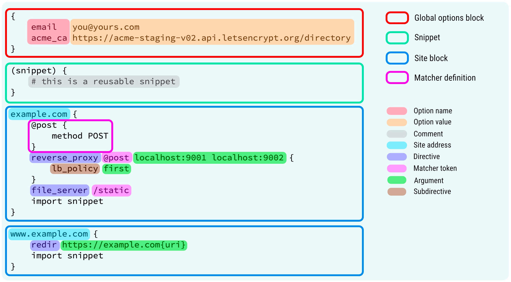

## 前言

在搭建博客期间，我在两个地方踩的坑最多，花的时间也最多。其一是 SSL 证书，其二是 Nginx。其实在了解之后配置 Nginx 和获取 SSL 证书也不算特别麻烦，但对以前没接触过的新手来说无疑是非常头疼的 (当然也有可能是 Apache)。但昨天 [naine][naine] 跟我提到了 Caddy，听说可以直接解决这两大问题，所以今天不是来倒这俩玩意的苦水，而是来试水 Caddy。

顺带一提在写这篇文章的时候，本站已经是使用 Caddy 进行工作了。


本文所有命令如无特别说明，请以 root 用户身份运行。



## Nginx VS Caddy

Nginx 作为老牌选手，自然拥有很多优点。

- 处理并发能力极强，可同时支持 2~4 万个连接。
- 低内存消耗，3 万并发连接，10 个 Nginx 进程的情况下，消耗内存不到 150 MB。
- 稳定性强，可连续运行数个月不需要重启，还支持热更新。
- 作为老牌软件一般很多系统官方源都有收录对应的包，安装较为简单 (最新版不一定简单)。

而 Caddy 的优点如下：

- Golang 写的，几乎无依赖，非常干净，一个二进制文件搞定。
- 无需配置，默认全站 https，自动申请证书，自动到期续签。
- 无需配置，默认全站 http2 (可以配置 http3)。
- 配置文件相比于 Nginx 非常简单，容易上手，一目了然。

综上，作为一个私人博客其实没有那么高的访问量和负载问题，nginx 除了稳定之外的大部分优点其实是用不到的，但是缺点较为明显，就是要自己去申请 SSL 证书，自己进行繁琐的配置。这对于一个新手来说是比较麻烦，要付出大量时间成本去试错的问题。而反过来 Caddy 的配置文件很简单，并且自动申请证书续签证书，对新手来说非常友好。看到这里我已经比较心动了，所以废话不多说，直接开工。

## Caddy 的安装

### Go 的安装

由于 Caddy 是 Golang 写的，我的系统不自带，所以需要先安装 Go。

先安装一些必要的软件包。

```bash
apt update
apt upgrade -y
apt install curl vim wget gnupg dpkg apt-transport-https lsb-release ca-certificates
```

然后根据[官方教程](https://go.dev/doc/install)进行安装。

```bash
wget https://go.dev/dl/go1.20.2.linux-amd64.tar.gz # 版本号可自选
rm -rf /usr/local/go && tar -C /usr/local -xzf go1.20.2.linux-amd64.tar.gz
echo export PATH=$PATH:/usr/local/go/bin | sudo tee -a /etc/profile # 这里与官方教程不一样，使用此命令可让此环境变量为所有用户生效
source /etc/profile
go version # 验证安装成功与否
```

### Xcaddy 的安装

#### Apt 安装

直接 `apt install` 安装的 caddy 不能自定义插件，可以使用官方的 xcaddy 自己编译加入了自己喜欢的插件的 caddy 二进制文件。

首先加入 caddy 的公钥和源

```bash
curl -sSL https://dl.cloudsmith.io/public/caddy/xcaddy/gpg.key | gpg --dearmor > /usr/share/keyrings/xcaddy.gpg
echo "deb [arch=$(dpkg --print-architecture) signed-by=/usr/share/keyrings/xcaddy.gpg] https://dl.cloudsmith.io/public/caddy/xcaddy/deb/debian any-version main" > /etc/apt/sources.list.d/xcaddy.list
```

然后

```bash
apt update
apt install xcaddy
xcaddy version
```

即可完成安装。

#### 编译安装

若是不喜欢 `apt` 安装，可以在

的releases中下载对应的包，自行编译安装。

#### Go 安装

也可以使用上一步安装好的 Go 来安装 xcaddy。

```bash
go install github.com/caddyserver/xcaddy/cmd/xcaddy@latest
```

不过我自己没试过，不知道具体效果如何有兴趣可自行尝试。

准备工作稍显麻烦，这也是 Caddy 对新手来说不太友好的地方。好在这是一劳永逸的，可以接受。

## 安装 Caddy

完成准备工作之后就可以正式开装了。Xcaddy 可以自定义插件编译，这里安装缓存和 Brotli 模块。因为我是阿里云的 DNS，所以再加一个阿里云 DNS 的模块，方便 SSL 证书的签发。

```bash
xcaddy build \
    --with github.com/caddyserver/cache-handler \
	--with github.com/ueffel/caddy-brotli \
	--with github.com/caddy-dns/alidns
```

完整的模块列表请看 [Modules - Caddy Documentation](https://caddyserver.com/docs/modules/)。

编译完成后便会在当前目录下产生一个二进制文件。运行

```bash
./caddy
```

即可查看帮助。

可以使用

```bash
ln -s /caddy的绝对路径/caddy /usr/bin/caddy
```

建立软连接，这样使用 Caddy 时就不用在前面加路径了。但是这样运行的 Caddy 会在/usr/bin 下找 Caddyfile，所以建议加入 `--config` 指定 Caddyfile 的路径，具体请看后文。

## Caddyfile

Caddy 可以使用 json 作为配置文件，但 json 编写较为麻烦，于是他们开发了 Caddyfile 作为配置文件。Caddyfile 的优点很明显，就是易读易写。事实上 Caddyfile 是被转换为之后 json 再被 Caddy 使用的，使用 Caddyfile 就是单纯的为了方面读写。

### 简单上手 Caddyfile

Caddy 运行时会自动寻找本身所在目录下的 Caddyfile 并加载。所以我们先在 caddy 二进制文件所在目录下新建一个 Caddyfile (不需要后缀)。

```bash
touch Caddyfile
```

先来看官方给出的结构解析



这里不打算很详细地写 Caddyfile 的所有功能，只打算帮想从 Nginx 换成 Caddyfile 的人快速度过学习阵痛期。如果想详细了解，可以看 [Caddyfile 语法浅析 - Kovacs](https://mritd.com/2021/06/30/understand-caddyfile-syntax/)。感谢大佬的解析，让我很快了解了 Caddyfile。

言归正传，虽然说易读易写，但刚接触还是需要一点时间学习。这里就以 Nginx 的配置文件为例，跟 Caddyfile 一部分一部分对应，会比较直观。

需要注意的是，**空格在 Caddyfile 中非常重要，所以不要输入无意义的空格**。

> The Caddyfile is lexed into tokens before being parsed. Whitespace is significant in the Caddyfile, because tokens are separated by whitespace.

以上是官网原话。

以下是我的 Nginx 配置中除了默认部分外自行配置的部分。

```nginx.conf
    server {
        listen       443 ssl http2 default_server;
        listen       [::]:443 ssl http2 default_server;
        server_name  'your ip';
        
        ssl_certificate /root/ipssl/ip.pem;
        ssl_certificate_key /root/ipssl/ip.key;
        ssl_session_timeout 5m;
        ssl_protocols TLSv1.1 TLSv1.2 TLSv1.3;
        return 444;
    } # 防止证书泄露源站IP

    server {
        listen       80 ;
        listen       [::]:80 ;
        server_name  'your ip' myvessel.top *.myvessel.top;
        rewrite ^(.*)$ https://$host$1 permanent;
    } # 将所有http请求重定向为https请求
```

关于防止证书泄露源站 IP，具体请看[从零开始的建站记#防止证书泄露源站IP](https://b.myvessel.top/posts//从零开始的建站记#防止证书泄露源站-ip)

```nginx.conf
upstream halo {
    server 127.0.0.1:8090;
} # 设置上游，可用于负载均衡，不过我没弄。可以给下方server块当作proxy主机使用

server {
    listen 443 ssl;
    listen [::]:443 ssl;
    server_name myvessel.top www.myvessel.top;
    
    ssl_certificate /etc/letsencrypt/live/myvessel.top/fullchain.pem;
    ssl_certificate_key /etc/letsencrypt/live/myvessel.top/privkey.pem;
    ssl_session_timeout 5m;
    ssl_protocols TLSv1.1 TLSv1.2 TLSv1.3;

    location / {
        proxy_pass http://halo; # 使用上游halo
        proxy_set_header HOST $host;
        proxy_set_header X-Forwarded-Proto $scheme;
        proxy_set_header X-Real-IP $remote_addr;
        proxy_set_header X-Forwarded-For $proxy_add_x_forwarded_for;
        client_max_body_size 1024m;
    }
} # 反向代理至halo，也就是本博客
```

以下是对应的 Caddyfile (使用效果并非完全一样，只是基本一致)。需要注意的是上面 Nginx 的配置是自己配置的部分，而下面的 Caddyfile 是完整的文件内容。

```Caddyfile
www.myvessel.top, myvessel.top {
	encode gzip # 因为nginx默认开启了gzip，所以这里也跟着一起开。
	reverse_proxy 127.0.0.1:8090 # 反向代理至8090端口
}
```

没错，就这么点。好了，本文圆满结束😋


开玩笑捏。不过上面的 Caddyfile 范例是真的可以直接投入使用的。也可以跟我一起做一些别的配置。让使用更顺心一点。

```Caddyfile
{
	storage file_system /root/caddy/
	# 让运行相关的文件保存至/root/caddy下，路径可随意自定义
	
	log {
		output file /root/caddy/logs/access.log {
			roll_uncompressed # 日志文件不启用gzip压缩
		}
	} # 自定义路径保存日志

	acme_dns alidns {
		access_key_id your_key
		access_key_secret your_secret
	} # 阿里云DNS认证配置

} # 第一个没有前缀的大括号内容即为全局配置，跟Nginx的全局配置类似

www.myvessel.top, myvessel.top { # 注释1
	encode gzip br # 装了Brotli所以启用
	reverse_proxy 127.0.0.1:8090
} # 大括号有地址前缀的即为站点配置，跟Nginx的server块类似。虽然只有单个站点的情况下可以不加大括号，但我还是建议全都加上大括号以防万一。
```

注释 1：此行大括号的前缀即为地址 (address)，可以理解为 Nginx 中 server 块中的 `server_name`。

什么？你问 SSL 证书相关配置去哪了？http 重写到 https 又去哪了？防止证书泄露源站 ip 的配置呢？

答案是不需要了，Caddy 已经默认帮你配置好了。默认全站 https (即自带 http 重写到 https，并自动申请证书，自动配置证书)，在[从零开始的建站记#防止证书泄露源站IP](https://myvessel.top/posts/将nginx更换为caddy/#简单上手-caddyfile) 中有提到 Nginx 1.19.4 以上给出了 `ssl_reject_handshake` 这个选项，Caddy 相当于默认启用了 `ssl_reject_handshake`，避免了因为证书泄露源站 IP。如果有需要当然可以对着官方文档自己动手调整相关配置。但如果没有精力做这些，直接开箱即用即可，非常舒畅简便。

如果需要数字 IP 访问，并进行了对应的站点配置。根据官方文档[此处](https://caddyserver.com/docs/v2-upgrade#https-and-ports)的说明，IP 的 SSL 证书将从本地信任的嵌入式 CA 颁发证书。

关于“转发”效果的功能，实例只提到了 `reverse_proxy`，实际上一共有以下几种：

- `reverse_proxy`：即反向代理，与 Nginx 中 server 块中的 `location / {}` 类似。
- `root`：与 Nginx 中 server 块中的 `root` 类似。可以换一行加上 `file_server` 表示提供静态文件服务器，加上 `php_fastcgi [以及后续参数]` 提供 PHP 服务。
后两种是对访问 URI 进行操作。
- `redir`：将请求 URI 重定向至某个 URI。
- `rewrite`：将请求 URI 重写至某个 URI。与 `redi` 的不同之处在于使用 `rewrite` 时请求客户端显示的 URI 不变，重写是在内部进行的。而 `redi` 会让客户端的 URI 一起变化。

也就是说，Caddy 的自动 https 重写，实际上是用 redir 完成的，相当于在每个站点配置中加入了如下字段：

```Caddyfile
	@http {
		Protocol http
	}
	redir @http https://{host}{uri}
```

其中@开头前缀的大括号作用是定义匹配器，可以实现复杂的匹配功能，以供调用。


若是想开启 http 3，可在全局配置 (即第一个没有前缀的大括号)中加入如下字段：

```Caddyfile
servers : 443 {
	protocols h1 h2 h3 #也可以只写 h3，表示只允许 http3 连接，不过兼容性差
}
```

即可开启 http 3。

### 测试，格式化 Caddyfile

写好了 Caddyfile，自然不能直接启用，要先测试一下有没有问题。官方给出了如下命令用来测试：

```bash
caddy validate
```

效果对应 Nginx 的`nginx -t`。~~感觉... 不如`nginx -t`... 简洁~~默认在 caddy 二进制文件所在目录下寻找 Caddyfile，若 Caddyfile 在别处可在命令后加入`--config /Caddyfile 的路径`。

事实上，自己编写的 Caddyfile 可能会有很多不规范的格式。若有强迫症，可在测试通过后使用官方给出的

```bash
caddy fmt --overwrite
```

来对 Caddyfile 内容进行格式化。

同样是默认在 caddy 二进制文件所在目录下寻找 Caddyfile，若 Caddyfile 在别处可直接在命令末尾空一格再加上 Caddyfile 的路径。

## 启动 Caddy

就算比起 Nginx 友好得多，过程对新手也还是有点难的。不过现在终于完事了，可以投入使用了。Caddy 有两种启动方法，分别是`caddy run`和`caddy start`。区别在于`caddy run`会在前台启动 Caddy，官方说 Ctrl+C 或者退出终端会结束 Caddy 进程 (但根据我亲身体验，完全放屁，只有`kill -9`才能彻底停止，否则会一直占用端口)。而`caddy start`会在后台启动，你可以关闭终端去做任何事。可以使用`caddy stop`来停止进程。所以正常投入使用时，应该选择`caddy start`而不是`caddy run`。

启动后，一开始是访问不了的，因为 Caddy 还在申请证书。等一会就可以访问了。日志中可以看到

```log
tls.obtain certificate obtained successfully
```

的字样，说明证书申请成功了。

根据官方文档[此处](https://caddyserver.com/docs/v2-upgrade#https-and-ports)和[此处](https://caddyserver.com/docs/caddyfile/options#acme-ca)的说明，若不进行特别配置，证书默认由 Let's Encrypt 或 ZeroSSL 颁发。我这边是随机到 Let's Encrypt 的证书。

在运行过程中，可以使用`caddy reload`来重载配置文件，与 Nginx 中`nginx -s reload`类似。

## 保护 Caddy 进程

其实本来直接`caddy start`就挺方便的，进程也挺稳定。但有人喜欢用 systemd 来管理。官方也给出了[教程](https://caddyserver.com/docs/running#manual-installation)。简单总结一下流程。

首先确认 caddy 文件位于/usr/bin/下，或使用上文提到的软连接。然后添加用户组和用户：

```bash
groupadd --system caddy
useradd --system \
	--gid caddy \
	--create-home \
	--home-dir /var/lib/caddy \
	--shell /usr/sbin/nologin \
	--comment "Caddy web server" \
	caddy
```

然后在/etc/systemd/system/下新建`caddy.service`，在里面写入如下内容：

```caddy. Service
[Unit]
Description=Caddy
Documentation= https://caddyserver.com/docs/
After=network. Target network-online. Target
Requires=network-online. Target

[Service]
Type=notify
User=caddy
Group=caddy
ExecStart=/usr/bin/caddy run --environ --config /etc/caddy/Caddyfile
ExecReload=/usr/bin/caddy reload --config /etc/caddy/Caddyfile --force
TimeoutStopSec=5 s
LimitNOFILE=1048576
LimitNPROC=512
PrivateTmp=true
ProtectSystem=full
AmbientCapabilities=CAP_NET_BIND_SERVICE

[Install]
WantedBy=multi-user. Target
```

请仔细检查`execStart`和`execReload`中的路径是否符合自己实际情况，然后保存退出。

然后

```bash
Systemctl daemon-reload
Systemctl enable --now caddy
Systemctl status caddy
```

若为`active`，则运行成功。

~~但我自己运行失败，查了一下可能是 selinux 的问题，但我压根没有 selinux。一气之下直接不弄了，继续`caddy start`~~。

## 后记

Caddy 比起 Nginx + Certbot 简单了不止一点，属于是新手福音了。当初要是先看到 Caddy，建站时间肯定能省好几天。不过 Nginx + Certbot 也让我学到了不少东西就是了。提前上课，避免补课。如果你还在为 Nginx 的配置和 SSL 证书烦恼，不妨也来试试 Caddy。

## 参考文章

除了提及的各官方文档外，感谢以下文章的作者：

[Debian 11 / Ubuntu 22.04 使用 xcaddy 自定义编译 Caddy - 烧饼博客](https://u.sb/xcaddy/)

[Caddyfile 语法浅析 - Kovacs (mritd.com)](https://mritd.com/2021/06/30/understand-caddyfile-syntax/)

[从 Nginx 切换到 Caddy - Kovacs (mritd.com)](https://mritd.com/2021/08/20/switching-rrom-nginx-too-caddy/)

 

[naine]: https://ena.sh