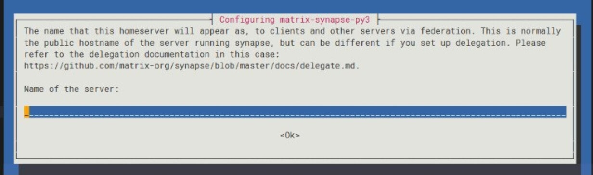

## 前言

被[naine][naine] 要求当工具人，搭建 Matrix 服务器试试效果。Matrix 是一个去中心化，开源的实时通信服务框架，详情请谷歌~~其实能找到这篇文章的人完全不需要这些解释吧~~。

首先选择搭建哪一种服务端，就我没有特意去查，即便如此也看到的服务端有三种，分别是：
1. Synapse：Matrix 开发团队用 Python 写的第一代服务端，稳定但庞大，对服务器性能要求高，部署麻烦。
2. Dendrite：Matrix 开发团队用 Go 写的第二代服务端，性能表现更好（也就是对服务器性能要求没那么高）。
3. Conduit：第三方开发的用 Rust🦀 写的服务端。切中以上两者痛点，面向小型服务器，主打部署便捷，能快速运行起来而不需要去啃官方又臭又长的文档。

我的需求是不到 5 个人的超小聊天室，按照以上的特性归纳，我毫无疑问应该选择 Conduit …… 本来应该是这样的，但看到本文标题就应该明白最后选择的还是 Synapse。原因是[naine][naine] 要求用 Synapse 来搭建。工具人没有话语权，所以我们放弃看起来很方便的 Conduit，来搭建庞大的 Synapse。在搜介绍的时候看到有人说 Synapse 作为第一代官方服务端，用的人最多，所以网上各种教程也最多。但我在网上查到的中文搭建教程非常少，一共才三四篇~~可能外文教程比较多吧~~。总之过程中踩了不少坑，所以来记录一下工具人生活，也希望能让同样需求的人少踩点坑。

## 环境

我的环境是嫖自谷歌云的 4h4g 的 Debian 11。Synapse 需要的具体配置我没有调查，但是作为实时聊天服务器，性能还是尽量往高走。正好 4h4g 只搭个博客也太浪费了，搭 Synapse 也算是充分利用性能了。

## 安装

下面开始正式搭建过程。


本文所有命令如无特别说明，请以 root 用户身份运行。


### PostgreSQL 的安装

官方并没有对数据库类型做出要求，默认使用 sqlite3 作为数据库。但 sqlite3 虽然方便，性能却极其拉跨。所以选择使用官方推荐的 PostgreSQL 作为数据库。

安装过程也很简便。首先更新一下软件包列表然后安装 PostgreSQL：

```bash
apt update
apt install postgresql
```

即可。重点是接下来的配置。

### PostgreSQL 的配置

先来做好数据库的配置，这样配置 synapse 的过程会比较流畅。

首先是一些新安装后的初始工作。刚安装好 PostgreSQL 时会自动新创建一个数据库用户和一个 Linux 系统用户，用户名都是 postgres，用以作为超级管理员管理数据库。所以先更改一下这两个用户的密码。

```bash
su postgres #以postgres用户登录Linux系统
psql #进入数据库
```

然后命令行前面的提示符会变成 `postgres=#`。接下来通过以下将数据库用户 postgres 的密码更改为 `example`。

```bash
ALTER USER postgres WITH PASSWORD 'example';
```

**注意在数据库内**`;`**才代表这句命令完全结束了**。若未完全结束，前面的提示符会变成 `postgres-#`。所以记得加上 `;`。

然后使用 `\q` 退出数据库，然后使用 `exit` 退出 postgres 用户回到 root 用户。接着使用以下命令修改 Linux 系统用户 postgres 的密码。

```bash
passwd -d postgres #清除postgres用户的初始密码
su postgres #重新进入postgres用户
passwd #修改postgres用户的密码
```

接着说一下我的目标：直接用管理员用户使用数据库会比较危险。所以为了避免误操作，建立一个新数据库用户 `synapse_user` 并设置密码；并建立一个新数据库 `synapse` 供 Synapse 使用。

执行完上一部分命令后现在是 postgres 的系统用户身份。如果不小心退出了请使用 `su postgres` 回到此用户身份。

先执行以下命令创建数据库用户 `synapse_user`：

```bash
createuser --pwprompt synapse_user
```

其中 `--pwprompt` 表示建立该用户时设置密码，更详细的参数可参考 [createuser](http://www.postgres.cn/docs/9.3/app-createuser.html)。

然后进入数据库

```bash
psql
```

创建使用 UTF-8 编码，使用 ISO C 国际标准区域规则（即去除本地化，因为聊天服务器当然不止一个国家的人用~~但我和朋友一起用好像也没必要啊~~），使用数据库模板 `template0`（即纯净数据库，`template1` 为本地化后的数据库）的数据库 `synapse`：

```bash
CREATE DATABASE synapse
ENCODING 'UTF8'
LC_COLLATE='C'
LC_CTYPE='C'
template=template0
OWNER synapse_user;
```

关于 `LC_COLLATE` 和 `LC_CTYPE` 等详情，可查阅 [23.1. 区域支持](http://www.postgres.cn/docs/10/locale.html)。关于 `template0` 和 `template1`，可查阅 [22.3. 模板数据库](http://postgres.cn/docs/10/manage-ag-templatedbs.html)。

接着来到 `/etc/postgresql/<pg_version>/main/` 下修改配置文件 `pg_hba.conf`，其中 `pg_version` 是你的 PostgreSQL 版本号。若没有找到该路径或文件请使用 `find / -name pg_hba.conf` 命令找到 `pg.hba.conf` 文件在哪。`pg_hba.conf` 用于配置客户端对数据库进行认证的详细参数。具体格式和内容可参考 [pg\_hba.conf文件](http://www.postgres.cn/docs/9.4/auth-pg-hba-conf.html)。这里按照我的需求在文件末尾新开一行添加以下内容：

```conf
host    synapse     synapse_user    ::1/128     md5
```

每项参数含义如下：
- host：允许 TCP/IP 连接，不论是否使用 SSL。
- synapse：只允许连接数据库 `synapse`。
- synapse_user：只允许用户 `synapse_user` 连接此数据库。
- ::1/128：即 127.0.0.1/32。
-  md5：使用 md5 加密密码。**若没有设置密码请将此项改为 trust**。

保存退出，至此，PostgreSQL 的配置就彻底完成了~~什么？调参？不会！告辞！大佬请自行调参~~。接下来终于可以开始正题 —— Synapse 的安装了。

### Synapse 的安装

Synapse 的安装也是非常的简单。首先安装依赖：

```bash
apt install -y lsb-release wget apt-transport-https
```

然后安装 Matrix 官方仓库 GPG 公钥，添加其官方源。

```bash
wget -O /usr/share/keyrings/matrix-org-archive-keyring.gpg https://packages.matrix.org/debian/matrix-org-archive-keyring.gpg
echo "deb [signed-by=/usr/share/keyrings/matrix-org-archive-keyring.gpg] https://packages.matrix.org/debian/ $(lsb_release -cs) main" |
tee /etc/apt/sources.list.d/matrix-org.list
```

然后更新软件列表并安装：

```bash
apt update
apt install matrix-synapse-py3
```

即可。安装过程会提示输入 server name：



server name 是服务器的唯一标识，还会影响到在你的服务器上注册的用户的用户名。按我查到的教程来说，好像是可以随意填的，但根据我**完全不严谨**的探索，想完全正常使用并且方便配置的话最好填自己的域名。比如我这里填 myvessel.top 。Matrix 的 Delegation 功能使得 Synapse 可以和其他 server 共用同一个域名，所以不需要担心这个域名已经被别的 server 使用了。Server name 在 Synapse 正式初始化并启动运行之后就不能随意更改了，除非删除数据库重新开始~~但这玩意安装好之后自动就启动了，真是 nt 逻辑~~，也就是说不在这里填对就得删库，所以请慎重填写。

然后会问你是否发送匿名数据供他们统计，请按个人喜好选择。我选择拒绝😀。

看起来 server name 已经算坑了，但真正的大坑还在后头~~这俩东西都是安装一时爽，配置火葬场~~。

### Synapse 的配置

然后终于来到了本文重头戏，配置 Synapse，**大坑**。

配置 Synapse 主要是配置位于 `/etc/matrix-synapse/` 的 `homeserver.yaml` 文件。**这里首先就有个坑**，按我找到的几篇中文教程的语境，貌似安装好 Synapse 后会自动给一个非常详细的，很多注释项的 `homeserver.yaml`。但实际上我看到的 `homeserver.yaml` 是一个非常简陋的，并且不能投入使用的文件。有教程自行进行每一项的配置，但按我这个非常简陋的 `homeserver. yaml` ，每一项都需要去对着[官方的配置手册](https://matrix-org.github.io/synapse/latest/usage/configuration/config_documentation.html) 自己添加，这也太麻烦了，而且官方文档写的也不是很出色，缺少实例，自己对着写出问题概率很高。但其实直接使用官方的生成配置文件功能即可解决这个问题。

首先来到 `/etc/matrix-synapse/` 下，把原本的 `homeserver.yaml` 删了，然后运行以下命令：

```bash
/opt/venvs/matrix-synapse/bin/python -B -m synapse.app.homeserver -c homeserver.yaml --generate-config --server-name=example.com --report-stats=no
```

其中 `example.com` 请替换为自己的 server name。

运行完成后当前目录就会多出几个文件，都是运行需要的文件，不用乱动。再打开新生成的 `homeserver.yaml`，这时就会发现多了几项内容，并且都已经填好了内容。有一篇教程使用自行生成的随机字符串作为 `registration_shared_secret` ，但其实直接使用这个生成功能，会自动把 `registration_shared_secret` 也生成了，就不必担心自己生成的字符串有问题了。

此时这个配置文件已经是可以投入正常使用的配置文件了，但我们还要修改一下，便于自己使用。

首先把 sqlite3 数据库更换为前面累死累活安装配置好的 PostgreSQL 数据库。

在内容中找到 sqlite3 相关的配置，然后注释掉或者删去。替换为以下内容：

```yaml
database:
    name: psycopg2
    args:
        user: synapse_user
        password: yourpassword
        database: synapse
        host: 127.0.0.1
        cp_min: 5
        cp_max: 10
        keepalives_idle: 30
        keepalives_interval: 10
        keepalives_count: 3
```

将以上内容根据自己实际情况填写。

另外注意 yaml 对缩进和空格要求非常严格，所以请确保自己对齐了。

以下是我的配置：

```yaml
server_name: "myvessel.top"
pid_file: /etc/matrix-synapse/homeserver.pid
listeners:
  - port: 8008
    tls: false
    type: http
    x_forwarded: true
    bind_addresses: ['::1', '127.0.0.1']
    resources:
      - names: [client, federation]
        compress: false
#database:
#  name: sqlite3
#  args:
#    database: /etc/matrix-synapse/homeserver.db
database:
    name: psycopg2
    args:
        user: synapse_user
        password: yourpassword
        database: synapse
        host: 127.0.0.1
        cp_min: 5
        cp_max: 10
        keepalives_idle: 30
        keepalives_interval: 10
        keepalives_count: 3
log_config: "/etc/matrix-synapse/myvessel.top.log.config"
media_store_path: /etc/matrix-synapse/media_store
registration_shared_secret: "example"
report_stats: false
macaroon_secret_key: "example"
form_secret: "example"
signing_key_path: "/etc/matrix-synapse/myvessel.top.signing.key"
trusted_key_servers:
  - server_name: "matrix.org"
  - server_name: "neo.angry.im"
  - server_name: "bgme.me"
suppress_key_server_warning: true
enable_registration: true
enable_registration_without_verification: true
```

其中的敏感内容都用 "example" 进行了替代，替代前都是实际可用的值。

`trusted_key_servers` 是现有的信任服务器，不能为空，默认为 `matrix.org`，可以加入自己认识的实例，我这里添加了 `neo.angry.im` 和 `bgme.me` ~~虽然并没有用上~~。除此之外最后 3 行是我新配置的内容，效果分别如下：
- `suppress_key_server_warning`：如果 `trusted_key_servers` 中有 `matrix.org`，此项须设为 `true`，否则启动时会有警告。
- `enable_registration`：设为 `true` 时允许注册。不能单独启用，下面必须设置注册验证方式或设为不验证即可注册。详情请查阅[官方说明](https://matrix-org.github.io/synapse/latest/usage/configuration/config_documentation.html#enable_registration)。
- `enable_registration_without_verification`：设为 `true` 时允许不验证即可注册。

配置好之后运行：

```bash
systemctl restart matrix-synapse
```

若无报错，即成功运行 Synapse。若有报错，请检查配置。

然后可运行：

```bash
wget http://localhost:8008
cat index.html
```

若有出现“Synapse is running”相关字眼，则说明成功运行了。

接下来给自己注册一个管理员账号，在终端里输入：

```bash
register_new_matrix_user -c /etc/matrix-synapse/homeserver.yaml http://localhost:8008
```

然后在询问是否为管理员账户时输入 yes 即可。

在终端用以上方式进行注册是不受上文中 `enable_registration` 这一项的影响的，所以如果人数少并且用户不介意的话，可以直接在终端给全部用户都全部注册好，这样也就不需要开启注册了。

因为按我的需求，除了我之外只有几个人注册，所以我直接设为不验证注册了，注册完之后再把 `enable_registration` 和 `enable_registration_without_verification` 这两行删掉或者注释掉，然后再使用：

```bash
systemctl restart matrix-synapse
```

即可生效。**每次修改了 `homeserver.yaml` 都需要运行上面的命令使新配置生效**。

另外如果需要修改 server name，首先需要删除数据库重新创建，然后需要修改 `homeserver.yaml` 里的 `server_name`，以及 `/etc/matrix-synapse/conf.d/` 下的 `server_name.yaml` 里面的 `server_name` 这两个 `server_name` 需要保持一致。再用上面的命令 restart 即可。

## 配置外部访问

为了让别人能用域名进行访问，需要设置反向代理，可参考[官方文档](https://matrix-org.github.io/synapse/latest/reverse_proxy.html)。前文以及说过由于 Matrix 的 [Delegation](https://matrix-org.github.io/synapse/latest/delegate.html) 功能，使得 Synapse 可以和其他 server 共用同一个域名。而由于 server name 会影响你的账户名（形如@xxxx: example.com）。我觉得后面跟个老长的三级域名实在很不方便，所以选择直接用我的二级域名 `myvessel.top` 来作为 server name。

我使用的是 Caddy，原 Caddyfile 内容如下：

```Caddyfile
www.myvessel.top , myvessel.top {
    encode gzip br
    root * /root/homepage
    file_server
}
```

然后直接按照[官方文档](https://matrix-org.github.io/synapse/latest/reverse_proxy.html#caddy-v2)配置 Caddyfile 如下：

```Caddyfile
www.myvessel.top , myvessel.top {
    encode gzip br
    root * /root/homepage
    file_server
    
    header /.well-known/matrix/* Content-Type application/json
    header /.well-known/matrix/* Access-Control-Allow-Origin *
    respond /.well-known/matrix/server `{"m.server": "matrix.myvessel.top:443"}`
    respond /.well-known/matrix/client `{"m.homeserver":{"base_url":"https://matrix.myvessel.top"},"m.identity_server":{"base_url":"https://identity.myvessel.top"}}`
}

matrix.myvessel.top {
    reverse_proxy /_matrix/* localhost:8008
    reverse_proxy /_synapse/client/* localhost:8008
}
```

可能有人会有疑惑这个 `identity.example.com` 没有配置过啊，是不是需要自己额外配置？答案是不需要，按照文档里写上就行了。

配置好反向代理之后按理来说就可以访问了，但我这里因为使用了 Delegation 功能，所以直接访问我的 server name 是看不到 Matrix 的相关信息的。所以使用 [Matrix Federation Tester](https://federationtester.matrix.org/) 进行测试。在里面输入自己的 server name，若下方无报错并出现四个 Success 字样，即表示搭建成功，正常运行。接着就可以在各种客户端上使用了，可在 [Clients | Matrix.org](https://matrix.org/clients/) 中寻找心仪的客户端。

## 后记

这也算是比较大的项目了，即使比起小白时有所长进，也还是磕磕绊绊踩了不少坑。顺便吐槽一下搭好之后用了不到一小时[naine][naine] 就觉得不好用，直接抛弃了~~铁渣男~~。所以撰写本文时服务器已经关闭了。但折腾过程还是挺有意思的，值得记录一下。

## 参考文章

除文中提及的官方文档外，参考文章如下：

- [Matrix聊天服务器Synapse的搭建 - Fantasy Land](https://east.moe/archives/1175)
- [Matrix踩坑记（一） - 影子屋](https://yingziwu.gitlab.io/posts/matrix-deployment-process-part-1/)
- [安装Matrix系统（Riot.im）的服务端Synapse - 简书](https://www.jianshu.com/p/5c445d8698a4)

感谢各位作者。


[naine]: https://ena.sh