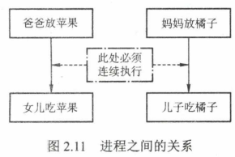
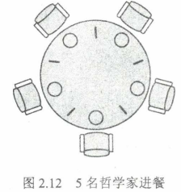

## 前言

本文完全摘自王道408操作系统书中内容，外加一点小小的笔记。因为有人想看所以整理好了放上来。

需要的前置知识：
1. 互斥锁
2. 信号量

祝看得开心。
## 生产者-消费者问题

问题描述：一组生产者进程和一组消费者进程共享一个初始为空、大小为 n 的缓冲区，只有缓冲区没满时，生产者才能把消息放入缓冲区，否则必须等待；只有缓冲区不空时，消费者才能从中取出消息，否则必须等待。由于缓冲区是临界资源；它只允许一个生产者放入消息，或一个消费者从中取出消息。

问题分析：
1. 关系分析。生产者和消费者对缓冲区互斥访问是互斥关系，同时生产者和消费者又是一个相互协作的关系，只有生产者生产之后，消费者才能消费，它们也是同步关系。
2. 整理思路。这里比较简单，只有生产者和消费者两个进程，正好是这两个进程存在着互斥关系和同步关系。那么需要解决的是互斥和同步 PV 操作的位置。
3. 信号量设置。信号量 mutex 作为互斥信号量，用于控制互斥访问缓冲池，互斥信号量初值为1;信号量 full 用于记录当前缓冲池中的''满”缓冲区数，初值为0。信号量 empty 用于记录当前缓冲池中的“空”缓冲区数，初值为 n 。

我们对同步互斥问题的介绍是一个循序渐进的过程。上面介绍了一个同步问题的例子和一个互斥问题的例子，下面来看生产者-消费者问题的例子是什么样的。

生产者-消费者进程的描述如下：
```cpp
semaphore mutex=1; //临界区互斥信号量
semaphore empty=n; //空闲缓冲区
semaphore full=0; //缓冲区初始化为空
producer(){ //生产者进程
	while(1){
		produce an item in nextp; //生产数据
		P (empty);(要用什么，P一下) //获取空缓冲区单元
		P (mutex);(互斥夹紧) //进入临界区
		add nextp to buffer;(行为) //将数据放入缓冲区
		V (mutex);(互斥夹紧) //离开临界区，释放互斥信号量
		V(full);(提供什么，V一下) //满缓冲区数加1
	}
}
consumer(){ //消费者进程
	while(1){
		P(full); //获取满缓冲区单元
		P(mutex); //进入临界区
		remove an item from buffer; //从缓冲区中取出数据
		V(mutex); //离开临界区，释放互斥信号量
		V(empty); //空缓冲区数加1
		consume the item; //消费数据
	}
}
```
该类问题要注意对缓冲区大小为 n 的处理，当缓冲区中有空时，便可对 empty 变量执行 P 操作，一旦取走一个产品便要执行 V 操作以释放空闲区。对 empty 和 full 变量的 P 操作必须放在对 mutex 的 P 操作之前。**若生产者进程先执行 P(mutex),然后执行 P(empty)，消费者执行 P(mutex), 然后执行 P(full),这样可不可以？答案是否定的**。设想生产者进程已将缓冲区放满，消费者进程并没有取产品，即 empty = 0,当下次仍然是生产者进程运行时，它先执行 P(mutex)封锁信号量，再执行 P(empty)时将被阻塞，希望消费者取出产品后将其唤醒。轮到消费者进程运行时，它先执行 P(mutex),然而由于生产者进程已经封锁 mutex 信号量，消费者进程也会被阻塞，这样一来生产者、消费者进程都将阻塞，都指望对方唤醒自己，因此陷入了无休止的等待。同理，若消费者进程已将缓冲区取空，即 full = 0,下次若还是消费者先运行，也会出现类似的死锁。不过生产者释放信号量时，mutex, full 先释放哪一个无所谓，消费者先释放 mutex 或 empty 都可以。

笔记：实现互斥的 P 操作一定要放在实现同步的 P 操作之后，否则可能导致死锁。

下面再看一个较为复杂的生产者-消费者问题。

问题描述：桌子上有一个盘子，每次只能向其中放入一个水果。爸爸专向盘子中放苹果，妈妈专向盘子中放橘子，儿子专等吃盘子中的橘子，女儿专等吃盘子中的苹果。只有盘子为空时，爸爸或妈妈才可向盘子中放一个水果；仅当盘子中有自己需要的水果时，儿子或女儿可以从盘子中取出。



问题分析： 
1. 关系分析。这里的关系要稍复杂一些。由每次只能向其中放入一只水果可知，爸爸和妈妈是互斥关系。爸爸和女儿、妈妈和儿子是同步关系，而且这两对进程必须连起来，儿子和女儿之间没有互斥和同步关系，因为他们是选择条件执行，不可能并发，如图2.11所示。
2. 整理思路。这里有4个进程, 中取出。实际上可抽象为两个生产者和两个消费者被连接到大小为1 的缓冲区上。
3. 信号量设置。首先将信号量 plate 设置互斥信号量，表示是否允许向盘子放入水果，.初值为1表示允许放入，且只允许放入一个。信号量 apple 表示盘子中是否有苹果，初值为0 表示盘子为空，不许取，apple = 1表示可以取。信号量 orange 表示盘子中是否有橘子，初值为0表示盘子为空，不许取，orange = 1表示可以取。

解决该问题的代码如下：
```cpp
semaphore plate=l, apple=0, orange=0;
dad(){ //父亲进程
	while(1){
		prepare an apple;
		P(plate); //互斥向盘中取、放水果
		put the apple on the plate; //向盘中放苹果
		V(apple); //允许取苹果
	}
}
mom(){ //母亲进程
	while(1){
		prepare an orange;
		P(plate); //互斥向盘中取、放水果
		put the orange on the plate; //向盘中放橘子
		V(orange); //允许取橘子
	}
}
son(){ //儿子进程
	while(1){
		P(orange); //互斥向盘中取橘子 
		take an orange from the plate;
		V(plate); //允许向盘中取、放水果
		eat the orange;
	}
} daughter(){ //女儿进程
	while(1){
		P(apple); //互斥向盘中取苹果
		take an apple from the plate;
		V(plate); //允许向盘中取、放水果
		eat the apple;
	}
}
```
进程间的关系如图2.11所示。dad()和daughter。、mom()和son()必须连续执行，正因为如此, 也只能在女儿拿走苹果后或儿子拿走橘子后才能释放盘子，即V(plate)操作。
## 读者-写者问题

问题描述：有读者和写者两组并发进程，共享一个文件，当两个或以上的读进程同时访问共享数据时不会产生副作用，但若某个写进程和其他进程(读进程或写进程)同时访问共享数据时则可能导致数据不一致的错误。因此要求：
1. 允许多个读者可以同时对文件执行读操作；
2. 只允许一个写者往文件中写信息;
3. 任意一个写者在完成写操作之前不允许其他读者或写者工作；
4. 写者执行写操作前，应让己有的读者和写者全部退出。

问题分析: 
1. 关系分析。由题目分析读者和写者是互斥的，写者和写者也是互斥的，而读者和读者不存在互斥问题。
2. 整理思路。两个进程，即读者和写者。写者是比较简单的，它和任何进程互斥，用互斥信号量的 P 操作、V 操作即可解决。读者的问题比较复杂，它必须在实现与宣者互斥的同时，实现与其他读者的同步，因此简单的一对 P 操作、V 操作是无法解决问题的。这里用到了一个计数器，用它来判断当前是否有读者读文件。当有读者时，写者是无法写文件的，此时读者会一直占用文件，当没有读者时，写者才可以写文件。同时，这里不同读者对计数器的访问也应该是互斥的。
3. 信号量设置。首先设置信号量 count 为计数器，用于记录当前读者的数量，初值为0；设置 mutex 为互斥信号量，用于保护更新 count 变量时的互斥；设置互斥信号量 rw,用于保证读者和写者的互斥访问。

代码如下:
```cpp
int count=0; //用于记录当前的读者数量
semaphore mutex=l; //用于保护更新count变量时的互斥
semaphore rw=l; //用于保证读者和写者互斥地访问文件
writer(){ //写者进程
	while(1){
		P(rw); //互斥访问共享文件
		writing; //写入
		V(rw); //释放共享文件
	}
}
reader(){ //读者进程
	while(1){
		P(mutex); //互斥访问count变量
		if(count==0) //当第一个读进程读共享文件时
			P(rw); //阻止写进程写
		count++; //读者计数器加1
		V(mutex); //释放互斥变量count
		reading; //读取
		P(mutex); //互斥访问count变量
		count--; //读者计数器减1
		if (count==0) //当最后一个读进程读完共享文件
			V(rw); //允许写进程写
		V(mutex); //释放互斥变量count
	}
}
```
在上面的算法中，读进程是优先的，即当存在读进程时，写操作将被延迟，且只要有一个读进程活跃，随后而来的读进程都将被允许访问文件。这样的方式会导致写进程可能长时间等待，且存在写进程“饿死”的情况。

笔记：但这里的 reading 前后有加解锁的操作，所以实际上并不能做到同时读，可以立即为：读者的同时读，并不是指同时 reading，而是在 reader 执行结束之前别的 reader 就可以执行了。但 reading 本身依然是互斥执行的。

若希望写进程优先，即当有读进程正在读共享文件时，有写进程请求访问，这时应禁止后续读进程的请求，等到己在共享文件的读进程执行完毕，立即让写进程执行，只有在无写进程执行的情况下才允许读进程再次运行。为此，增加一个信号量并在上面程序的 writer。和 reader。函数中各增加一对 PV 操作，就可以得到写进程优先的解决程序。
```cpp
int count=0; //用于记录当前的读者数量
semaphore mutex=l; //用于保护更新count变量时的互斥
semaphore rw=1; //用于保证读者和写者互斥地访问文件
semaphore w=l; //用于实现“写优先”
writer(){ //写者进程
	while(1){
		P(w); //在无写进程请求时进入
		P(rw); //互斥访问共享文件
		writing; //写入
		V(rw); //释放共享文件
		V(w); //恢复对共享文件的访问
	}
}
reader(){ //读者进程
	while(1){
		P(w); //在无写进程请求时进入
		P(mutex); //互斥访问count变量
		if (count==0) //当第一个读进程读共享文件时
			P(rw); //阻止写进程写
		count++; //读者计数器加1
		V(mutex); //释放互斥变量count
		V(w); //恢复对共享文件的访问
		reading; //读取
		P(mutex); //互斥访问count变量
		count--; //读者计数器减1
		if (count==0) //当最后一个读进程读完共享文件
			V(rw); //允许写进程写
		V(mutex); //释放互斥变量count
	}
}
```
这里的写进程优先是相对而言的，有些书上把这个算法称为读写公平法，即读写进程具有一样的优先级。当一个写进程访问文件时，若先有一些读进程要求访问文件，后有另一个写进程要求访问文件，则当前访问文件的进程结束对文件的写操作时，会是一个读进程而不是一个写进程占用文件(在信号量 w 的阻塞队列上，因为读进程先来，因此排在阻塞队列队首，而 V 操作唤醒进程时唤醒的是队首进程)，所以说这里的写优先是相对的，想要了解如何做到真正写者优先，可参考其他相关资料。

读者-写者问题有一个关键的特征，即有一个互斥访问的计数器count,因此遇到一个不太好解决的同步互斥问题时，要想一想用互斥访问的计数器count能否解决问题。
## 哲学家进餐问题

问题描述：一张圆桌边上坐着5名哲学家，每两名哲学家之间的桌上摆一根筷子，两根筷子中间是一碗米饭，如图2.12所示。哲学家们倾注毕生精力用于思考和进餐，哲学家在思考时，并不影响他人。只有当哲学家饥饿时，才试图拿起左、右两根筷子(一根一根地拿起)。若筷子已在他人手上，则需要等待。饥饿的哲学家只有同时拿到了两根筷子才可以开始进餐，进餐完毕后，放下筷子继续思考。



问题分析：
1. 关系分析。5名哲学家与左右邻居对其中间筷子的访问是互斥关系。
2. 整理思路。显然，这里有5个进程。本题的关键是如何让一名哲学家拿到左右两根筷子而不造成死锁或饥饿现象。解决方法有两个：一是让他们同时拿两根筷子；二是对每名哲学家的动作制定规则，避免饥饿或死锁现象的发生。
3. 信号量设置。定义互斥信号量数组 $chopstick[5] = \{1, 1, 1, 1, 1\}$,用于对5个筷子的互斥访问。哲学家按顺序编号为0〜4,哲学家 i 左边筷子的编号为 i，哲学家右边筷子的编号为 $(i+1)\%5$。
```cpp
semaphore chopstick[5] = { 1,1,1,1,1}; //定义信号量数组 chopstick[5],并初始化
Pi(){ //i号哲学家的进程
	do{
		P(chopstick[i]); //取左边筷子
		P(chopstick[(i+1)%5]); //取右边筷子
		eat; //进餐
		V(chopstick[i]); //放回左边筷子
		V(chopstick[(i+1)%5]); //放回右边筷子
		think; //思考
	} while(1);
}
```
该算法存在以下问题：当5名哲学家都想要进餐并分别拿起左边的筷子时(都恰好执行完 `wait(chopstick[i]);`)筷子已被拿光，等到他们再想拿右边的筷子时(执行 `wait(chopstick[(i+1)%5]);`) 就全被阻塞，因此出现了死锁。

为防止死锁发生，可对哲学家进程施加一些限制条件，比如至多允许4名哲学家同时进餐；仅当一名哲学家左右两边的筷子都可用时，才允许他抓起筷子；对哲学家顺序编号，要求奇数号哲学家先拿左边的筷子，然后拿右边的筷子，而偶数号哲学家刚好相反。

制定的正确规则如下：假设采用第二种方法，当一名哲学家左右两边的筷子都可用时，才允许他抓起筷子。
```cpp
semaphore chopstick(5] = {1,1,1,1}; //初始化信号量
semaphore mutex=l; //设置取筷子的信号量
Pi(){ //i号哲学家的进程
	do{
		P(mutex); //在取筷子前获得互斥量
		P(chopstick[i]); //取左边筷子
		P(chopstick[(i+1)%5]); //取右边筷子
		V(mutex); //释放取筷子的信号量
		eat; //进餐
		V(chopstick[i]); //放回左边筷子
		V(chopstick[(i+1)%5]); //放回右边筷子
		think; //思考
	} while (1);
}
```

笔记：这个方法并不好，左边的人在右边筷子不可用的情况下也能拿起左边筷子。说是“两边都可用才能拿起”，其实是“同时只能有一个人拿”，若因为上述情况拿不到两根筷子，则即使其他人两边筷子都在，也会被阻塞。也就是一个人吃不上，全桌都阻塞。

此外，还可采用 AND 型信号量机制来解决哲学家进餐问题，有兴趣的读者可以查阅相关资料，自行思考。

熟悉ACM或有过相关训练的读者都应知道贪心算法，哲学家进餐问题的思想其实与贪心算 法的思想截然相反，贪心算法强调争取眼前认为最好的，而不考虑后续会有什么后果。若哲学家 进餐问题用贪心算法来解决，即只要眼前有筷子能拿起就拿起的话，就会出现死锁。然而，若不仅考虑眼前的一步，而且考虑下一步，即**不因为有筷子能拿起就拿起，而考虑能不能一次拿起两根筷子才做决定的话，就会避免死锁问题**，这就是哲学家进餐问题的思维精髓。
## 吸烟者问题

问题描述：假设一个系统有三个抽烟者进程和一个供应者进程。每个抽烟者不停地卷烟并抽掉它，但要卷起并抽掉一支烟，抽烟者需要有三种材料：烟草、纸和胶水。三个抽烟者中，第一个拥有烟草，第二个拥有纸，第三个拥有胶水。供应者进程无限地提供三种材料，供应者每次将两种材料放到桌子上，拥有剩下那种材料的抽烟者卷一根烟并抽掉它，并给供应者一个信号告诉己完成，此时供应者就会将另外两种材料放到桌上，如此重复(让三个抽烟者轮流地抽烟)。

问题分析：
1. 关系分析。供应者与三个抽烟者分别是同步关系。由于供应者无法同时满足两个或以上的抽烟者，三个抽烟者对抽烟这个动作互斥(或由三个抽烟者轮流抽烟得知)。
2. 整理思路。显然这里有4个进程。供应者作为生产者向三个抽烟者提供材料。
3. 信号量设置。信号量 offerl, offer2, offer3分别表示烟草和纸组合的资源、烟草和胶水组合的资源、纸和胶水组合的资源。信号量 finish 用于互斥进行抽烟动作。

代码如下：
```cpp
int num=0; //存储随机数
semaphore offerl=0; //定义信号量对应烟草和纸组合的资源
semaphore offer2=0; //定义信号量对应烟草和胶水组合的资源
semaphore offer3-0; //定义信号量对应纸和胶水组合的资源
semaphore finish=0; //定义信号量表示抽烟是否完成
process P1(){ //供应者
while(1){
	num++;
	num=num%3;
	if(num==0)
		V(offerl); //提供烟草和纸
	else if (num==l)
		V(offer2); //提供烟草和胶水
	else V(offer==3); //提供纸和胶水
	任意两种材料放在桌子上;
	P(finish);
	}
}
process P2(){ //拥有烟草者
while(1){
	P(offer3);
	拿纸和胶水，卷成烟，抽掉;
	V(finish);
	}
}
process P3(){ //拥有纸者
	while(1){
	P(offer2);
	拿烟草和胶水，卷成烟，抽掉;
	V(finish);
	}
}
process P4(){ //拥有胶水者
	while(1){
	P(offerl);
	拿烟草和纸，卷成烟，抽掉;
	V(finish);
	}
}
```
笔记：关键在于不能把每种材料单独定为一个信号，应把每种组合定为信号。